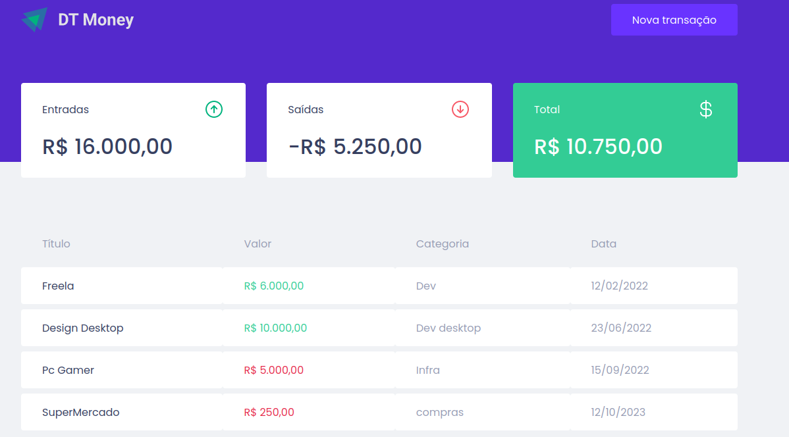
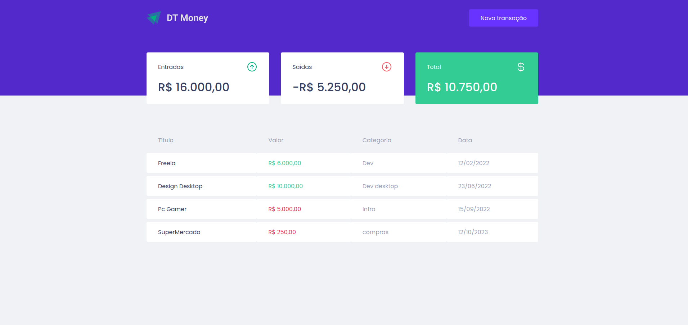
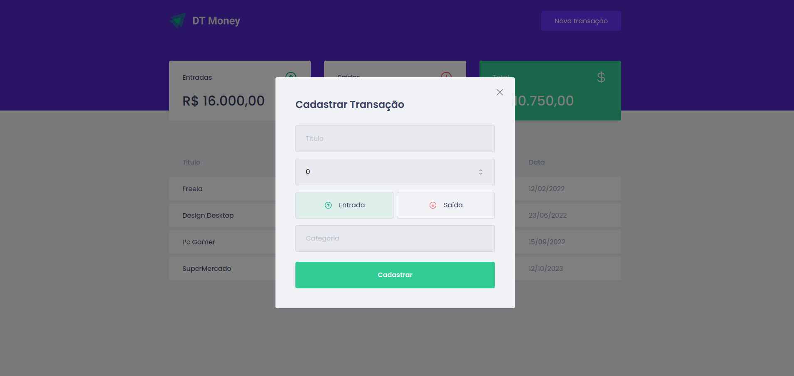

# DtMoney - Aplicação Frontend
Crud simples de um controle de entradas e saídas com React js, styled-component, Typescript e miragejs para simular back-end.

<h1 align="center">
    
    
    
</h1>

## 💻 Requisitos

Antes de iniciar, você deve ter o Node.js e o NPM instalados em sua máquina.

## 🚀 Instalando

Primeiro, você deve clonar o projeto na sua máquina, para isso você
pode colar o seguinte comando em seu terminal

```bash
git clone https://github.com/Tiago-Silva/dtmoney.git
```
Para instalar as dependências, execute o seguinte comando:

```bash
yarn install
```
ou

```bash
npm install
```

Por fim, para executar o projeto basta rodar o seguinte:

```bash
yarn start
```

## 📝 Licença

Este projeto está licenciado sob a licença MIT. Consulte o arquivo `LICENSE` para obter mais informações.
